<div align="center">

# Morrison Irreversibility Hypothesis™

### *Applied to Institutional Collapse*

#### *Analysis by Google Gemini*

-----


-----

> *“Applying the Morrison Irreversibility Hypothesis™ to institutional collapse shifts the analysis from ‘poor management’ (behavioral) to structural failure (geometric).”*
> 
> — Google Gemini

*An institution is a collective manifold held together by a Governance Constant (Λ).*

*When a company enters a death spiral, it is not just losing money or talent. It is losing its topological invariant.*

</div>

-----

## Table of Contents

- [The Core Reframe](#the-core-reframe)
- [The Variables of Institutional Health](#the-variables-of-institutional-health)
- [The Mechanics of the Death Spiral](#the-mechanics-of-the-death-spiral)
- [Geometric Structure](#geometric-structure)
- [Predicting the Snap](#predicting-the-snap)
- [Why Turnarounds Often Fail](#why-turnarounds-often-fail)
- [Morrison Horizon Indicators](#morrison-horizon-indicators)

-----

## The Core Reframe

The standard analysis of institutional failure asks: *what did management do wrong?*

The Morrison framework asks a different question entirely.

|Standard Analysis                |Morrison Analysis                 |
|:--------------------------------|:---------------------------------|
|Behavioral — poor decisions      |Geometric — structural deformation|
|Semantic — bad communication     |Topological — manifold fracture   |
|Probabilistic — risk accumulation|Physical — threshold crossing     |
|Reversible by default            |Irreversible past T_critical      |

$$T_{\text{irreversible}} = \Lambda \times \Delta G$$

The death spiral is not a management failure. It is a **mathematical certainty** once the threshold is crossed.

-----

## The Variables of Institutional Health

### Λ — Governance Constant

The structural backbone of the institution.

```
Λ includes:
  → Core mission and founding purpose
  → Internal checks and balances
  → Organisational culture
  → Operational protocols
  → Incentive alignment

High Λ  →  Institution absorbs shocks, returns to identity
Low  Λ  →  Small disturbances cause permanent deformation
```

Λ is not morale. It is not brand sentiment. It is the **geometric resistance** of the institution’s manifold to being pulled out of its stable state space.

-----

### ΔG — Geometric Deformation

The external and internal load acting on the institution.

```
ΔG sources:
  → Market volatility
  → PR scandals
  → Leadership churn
  → Regulatory shifts
  → Mission drift pressure
  → Internal factionalisation
```

$$\Delta G = G_{\text{institution after shock}} - G_{\text{institution before shock}}$$

Each shock deforms the institutional manifold. The question is whether Λ is strong enough to restore the original topology — or whether the deformation becomes permanent.

-----

## The Mechanics of the Death Spiral

### Phase 1 — Elastic Phase

$$\Lambda \times \Delta G < T_{\text{critical}}$$

The institution hits a crisis. Leadership responds with PR, corporate speak, and temporary cost-cutting — **Language-dimension tactics** (L-dimension scaling).

Because the threshold has not been breached, the company bounces back to its original identity. The geometry deforms but recovers. The manifold is elastic.

> *The institution survives — not because the tactics worked, but because Λ was still strong enough.*

-----

### Phase 2 — Plastic Phase

$$\Lambda \times \Delta G > T_{\text{critical}}$$

The load exceeds the strength. The culture snaps.

Employees stop believing in the mission. Departments pursue divergent goals. The internal geometry **fractures**. This is not a crisis. This is a **non-recoverable topological transition**.

> *The institution has entered a new basin of attraction. The original topology no longer exists.*

-----

### Phase 3 — The Inevitability Point

Once the threshold is crossed, collapse is a **mathematical certainty**.

No rebranding restores the topology. No town hall repairs the manifold. No new CEO reconstructs the Governance Constant from L-dimension interventions alone.

The institution is now in free fall — not because of what happens next, but because of what already happened geometrically.

-----

## Geometric Structure

### Fig 1 — The Three Phases of Institutional Collapse

```mermaid
flowchart TD
    START(["Institution\nInitial State — Λ strong"])

    START --> ELASTIC

    subgraph ELASTIC["Phase 1 — Elastic"]
        E1["Crisis hits\nΔG increases"]
        E2["L-dimension response\nPR · rebranding · cost-cutting"]
        E3["Λ × ΔG < T_critical\nThreshold not breached"]
        E4["Geometry recovers\nManifold returns to original basin"]
        E1 --> E2 --> E3 --> E4
    end

    E4 -->|"If Λ degrades over time"| PLASTIC

    subgraph PLASTIC["Phase 2 — Plastic"]
        P1["Larger shock arrives\nΔG surges"]
        P2["Λ × ΔG > T_critical\nThreshold breached"]
        P3["Culture fractures\nManifold topology broken"]
        P1 --> P2 --> P3
    end

    P3 --> INEVITABLE

    subgraph INEVITABLE["Phase 3 — Inevitability"]
        I1["New basin of attraction\nCollapse geometry locked in"]
        I2["L-dimension fixes fail\nTopology cannot be restored by behaviour"]
        I3["💥 INSTITUTIONAL COLLAPSE\nMathematical certainty"]
        I1 --> I2 --> I3
    end

    style ELASTIC fill:#0a1a0a,stroke:#2af4d8,color:#2af4d8
    style PLASTIC fill:#1a1005,stroke:#d4870a,color:#d4870a
    style INEVITABLE fill:#1a0505,stroke:#c0392b,color:#ff4433
    style START fill:#0a0d1a,stroke:#2563eb,color:#60a5fa
```



-----

### Fig 2 — Λ Degradation Over Time

```mermaid
flowchart LR
    subgraph STRONG["Strong Λ — Resilient Institution"]
        S1["Mission clarity\nHigh structural integrity"]
        S2["Shocks absorbed\nGeometry recovers"]
        S3["Institution survives\nTopology intact"]
        S1 --> S2 --> S3
    end

    subgraph DEGRADING["Degrading Λ — Vulnerable Institution"]
        D1["Mission drift begins\n∂Λ/∂t < 0"]
        D2["Each shock leaves\npermanent deformation"]
        D3["Λ × ΔG approaches T_critical\nCollapse imminent"]
        D1 --> D2 --> D3
    end

    subgraph COLLAPSED["Λ ≈ 0 — Failed Institution"]
        C1["No structural resistance\nManifold fully deformed"]
        C2["Any ΔG triggers\nirreversible transition"]
        C3["💥 COLLAPSE\nNew basin locked"]
        C1 --> C2 --> C3
    end

    STRONG -->|"Λ erosion begins"| DEGRADING
    DEGRADING -->|"Threshold crossed"| COLLAPSED

    style STRONG fill:#0a1a0a,stroke:#2af4d8,color:#2af4d8
    style DEGRADING fill:#1a1005,stroke:#d4870a,color:#d4870a
    style COLLAPSED fill:#1a0505,stroke:#c0392b,color:#ff4433
```



-----

### Fig 3 — Why L-Dimension Fixes Fail

```mermaid
flowchart TD
    FRACTURE["Topological Fracture Detected\nΛ × ΔG > T_critical"]

    FRACTURE --> LDIM["L-Dimension Response\nBehavioural / Semantic fixes"]
    FRACTURE --> CDIM["C-Dimension Response\nGeometric / Structural repair"]

    LDIM --> L1["New CEO announced"]
    LDIM --> L2["Rebrand launched"]
    LDIM --> L3["Town halls scheduled"]
    LDIM --> L4["Mission statement rewritten"]

    L1 & L2 & L3 & L4 --> LFAIL["❌ FAILS\nGeometry unchanged\nTopology still fractured\nCollapse proceeds"]

    CDIM --> C1["Governance Constants rebuilt\nΛ restoration"]
    CDIM --> C2["Structural invariants\nre-engineered"]
    CDIM --> C3["Basin of attraction\nreconstructed"]

    C1 & C2 & C3 --> CSUCCESS["✓ POSSIBLE RECOVERY\nIf initiated before\nT_critical is crossed"]

    style FRACTURE fill:#1a0505,stroke:#c0392b,color:#ff4433
    style LDIM fill:#1a0a0a,stroke:#c0392b,color:#c0392b
    style LFAIL fill:#2a0505,stroke:#ff4433,color:#ff4433
    style CDIM fill:#0a1505,stroke:#2af4d8,color:#2af4d8
    style CSUCCESS fill:#0a1a0a,stroke:#2af4d8,color:#2af4d8
```



-----

## Predicting the Snap

## Morrison Horizon Indicators

Institutional collapse can be predicted by measuring three early-warning signals.

-----

### Indicator 1 — Increased Noise

$$\frac{\partial L}{\partial I} \uparrow\uparrow$$

The institution compensates for eroding structural integrity with **corporate speak**.

More press releases. More internal memos. More rebranding language. More “alignment sessions.”

> *The volume of L-dimension output is inversely proportional to remaining Λ.*

This is an early warning. The institution is burning language to mask geometric deterioration.

-----

### Indicator 2 — Invariant Erosion

$$\frac{\partial \Lambda}{\partial t} < 0$$

The core mission is being diluted. The structural backbone is **thinning**.

Watch for: mission statement revisions, leadership that cannot articulate founding purpose, policy exceptions that become policy norms, values that shift under commercial pressure.

> *A thinning Λ makes the institution vulnerable to shocks it would previously have absorbed without consequence.*

-----

### Indicator 3 — Topological Fracture

$$\Delta G \text{ breach detected}$$

Different departments are operating in entirely different **basins of attraction**.

Engineering pursues one geometry. Sales pursues another. Leadership pursues a third. The manifold is no longer unified.

> *When internal factions stop sharing topological space, the institution is already in multiple pieces. The collapse is just catching up.*

-----

### Morrison Horizon Summary Table

|Indicator            |Formula                                   |What It Means                                 |Urgency        |
|:--------------------|:----------------------------------------:|:---------------------------------------------|:-------------:|
|Corporate speak surge|$\partial L / \partial I \uparrow\uparrow$|Compensating for structural loss with language|⚠️ Early warning|
|Mission dilution     |$\partial \Lambda / \partial t < 0$       |Governance backbone thinning                  |🔴 Critical     |
|Departmental fracture|$\Delta G$ breach                         |Manifold no longer unified                    |💥 Irreversible |

-----

## Why Turnarounds Often Fail

> *“To fix a broken institution, you don’t talk to it. You re-engineer its structural invariants.”*
> — Google Gemini, applying Morrison Irreversibility Hypothesis™

The Morrison Hypothesis predicts in **P5** that reversibility requires restoring topology, not behaviour.

Most struggling institutions attempt:

```
New CEO          →  L-dimension fix  →  Geometry unchanged
New slogan       →  L-dimension fix  →  Topology still fractured
Town halls       →  L-dimension fix  →  Basin of attraction unchanged
Cost-cutting     →  L-dimension fix  →  Λ not restored
Rebranding       →  L-dimension fix  →  Manifold still deformed
```

None of these address the **Governance Constant**.

The only path to genuine recovery is **C-dimension intervention**: rebuilding the structural invariants, restoring the original basin of attraction, and reconstructing Λ before T_critical is permanently exceeded.

$$\text{Recovery requires: } \Lambda_{\text{restored}} \times \Delta G < T_{\text{critical}}$$

If that window has closed — if the topological transition is already complete — no amount of behavioural intervention can undo it.

**The collapse was guaranteed the moment the geometry broke.**

-----

<div align="center">

-----


*The death spiral is not a management failure.*
*It is a mathematical certainty once the threshold is crossed.*

`ALL INVARIANTS RESERVED · MORRISON STACK™`

</div>
